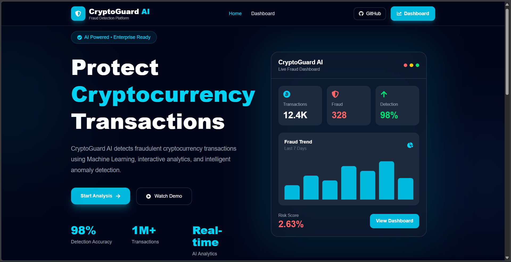
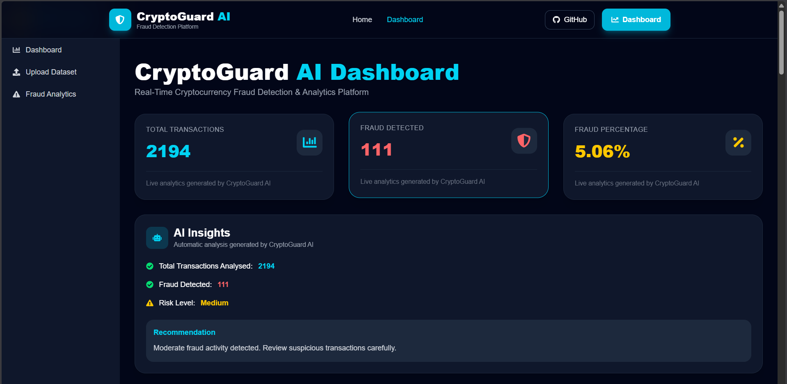
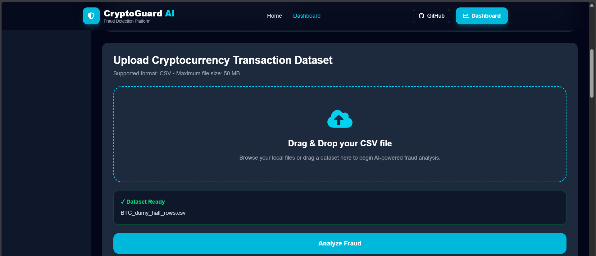
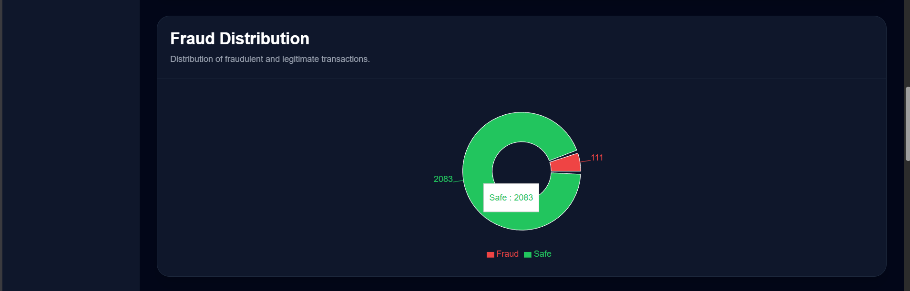
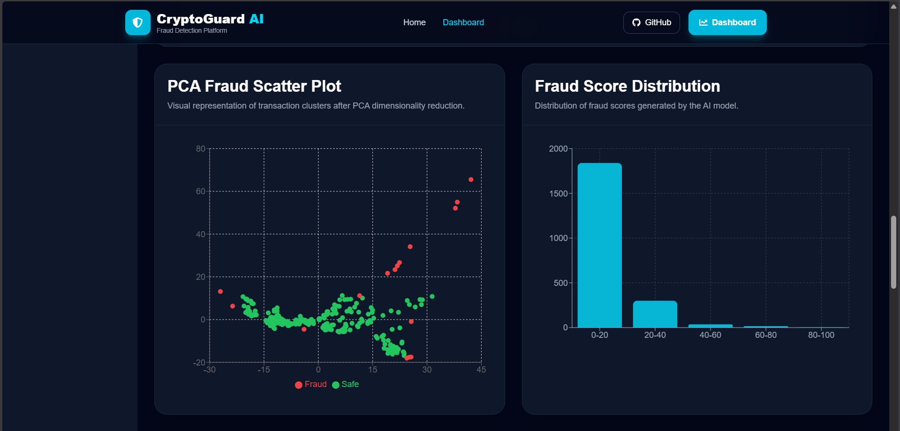
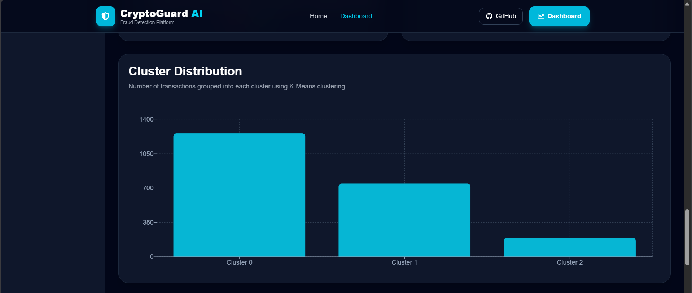
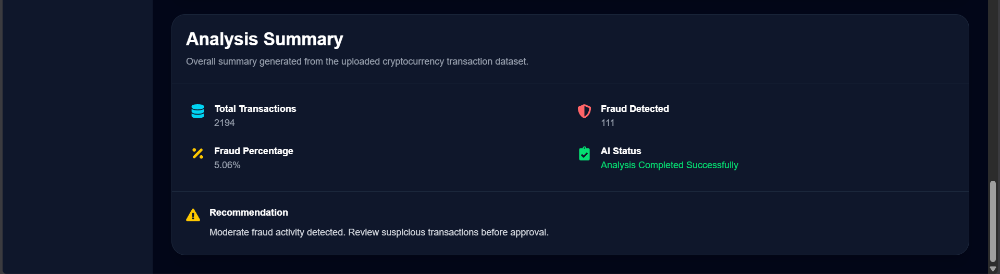

<div align="center">

# 🛡️ CryptoGuard AI

### AI-Powered Cryptocurrency Fraud Detection & Analytics Platform

Detect suspicious cryptocurrency transactions using **Machine Learning**, visualize fraud patterns, and generate intelligent fraud analytics through an end-to-end AI dashboard.

<p>


</p>

---

### 🚀 End-to-End Machine Learning Project

**React • FastAPI • Machine Learning • Isolation Forest • PCA • K-Means • Interactive Dashboard**

</div>

---

# 📖 Project Overview

CryptoGuard AI is a full-stack Machine Learning application developed to detect fraudulent cryptocurrency transactions through anomaly detection and intelligent analytics.

Users simply upload a cryptocurrency transaction dataset (CSV), and the application automatically performs:

- Data preprocessing
- Feature scaling
- PCA dimensionality reduction
- Fraud detection using Isolation Forest
- Behaviour clustering using K-Means
- Interactive visualization
- AI-generated analysis summary

The platform combines **Machine Learning**, **FastAPI**, and **React** to provide an intuitive fraud analytics dashboard.

---

# ✨ Key Features

## 🤖 AI Fraud Detection

- Detect suspicious cryptocurrency transactions
- Isolation Forest based anomaly detection
- Fraud score generation
- Intelligent AI Insights

---

## 📊 Interactive Dashboard

- Real-time Analytics Cards
- Fraud Distribution Pie Chart
- PCA Scatter Plot
- Fraud Score Histogram
- Cluster Distribution Chart
- Suspicious Transactions Table
- AI Analysis Summary

---

## 📂 Dataset Management

- CSV Upload
- Dataset Preview
- Real-time Processing
- Instant Fraud Analytics

---

## 📈 Advanced Visualizations

- Fraud Distribution
- PCA Visualization
- Cluster Analysis
- Fraud Histogram
- Analytics Cards

---

# 🧠 Machine Learning Pipeline

```text
CSV Dataset
      │
      ▼
Data Cleaning
      │
      ▼
Feature Selection
      │
      ▼
StandardScaler
      │
      ▼
Principal Component Analysis (PCA)
      │
      ▼
Isolation Forest
      │
      ▼
K-Means Clustering
      │
      ▼
Fraud Analytics Generation
      │
      ▼
Interactive React Dashboard
```

---

# 🏗️ System Architecture

```text
                        User
                         │
                         ▼
                 React Frontend
                         │
                         ▼
                 CSV File Upload
                         │
                         ▼
                FastAPI Backend API
                         │
       ┌─────────────────┼──────────────────┐
       ▼                 ▼                  ▼
StandardScaler        PCA Model      Isolation Forest
       │                 │                  │
       └─────────────────┼──────────────────┘
                         ▼
                 K-Means Clustering
                         │
                         ▼
             Analytics & JSON Response
                         │
                         ▼
               Interactive Dashboard
```

---

# 🛠️ Technology Stack

## Frontend

- React.js
- Tailwind CSS
- Axios
- React Router
- Recharts
- React Icons
- React Hot Toast

---

## Backend

- FastAPI
- Python
- Pandas
- NumPy
- Joblib
- Uvicorn

---

## Machine Learning

- Scikit-Learn
- Isolation Forest
- PCA
- StandardScaler
- K-Means Clustering

---

# 📸 Application Preview

## 🏠 Home Page



---

## 📊 Dashboard



---

## 🔍 Fraud Analysis

### Analytics Overview



### Interactive Charts



### PCA & Histogram



### Cluster Analytics



### Suspicious Transactions & Summary

